# Sectionator
Tool to assign sections to elements beam from GH to Strand7 


# 🔧 BXS Manager - Strand7

**Python application for automated BXS section management in Strand7**

Complete graphical interface to generate BXS files from IGES geometries and manage beam property assignment in Strand7 models.

---

## 📋 Table of Contents

- [Features](#-features)
- [Requirements](#-requirements)
- [Setup](#-setup)
- [Usage](#-usage)
  - [Tab 1: BXS Generation](#tab-1---bxs-generation)
  - [Tab 2: Property Creation](#tab-2---property-creation)
  - [Tab 3: Beam Assignment by ID](#tab-3---beam-assignment-by-id)
- [Architecture](#-architecture)
- [Complete Workflow](#-complete-workflow)
- [Troubleshooting](#-troubleshooting)
- [License](#-license)

---

## ✨ Features

### 🔹 BXS Generation from IGES
- Batch conversion of IGES files to BXS sections for Strand7
- Fully automated process: IGES import → surface mesh → mesh cleanup → BXS generation
- Parallel processing of multiple files with real-time monitoring

### 🔹 Beam Property Creation
- Automatic import of BXS sections into existing Strand7 models
- Beam property creation with material and section assignment
- Customizable property naming

### 🔹 Property Assignment by ID
- Automatic beam property assignment to elements based on their ID
- Intelligent property_name ↔ beam_ID mapping
- Case-insensitive property matching

### 🔹 User Interface
- Modern and intuitive GUI with CustomTkinter
- Dark mode
- Three dedicated tabs for separate workflows
- Detailed real-time logging for every operation
- Start/Stop controls for each process

---

## 🔧 Requirements

### Software
- **Python 3.8+** (tested with Python 3.10)
- **Strand7 R3** with API installed
- **Windows** (required for Strand7 API)

### Python Libraries
```bash
pip install customtkinter
```

### Configuration File
You need to create a `strand7_config.py` file in the same folder as the modules:

```python
# strand7_config.py
STRAND7_DLL_PATH = r"C:\Program Files\Strand7 R3\StrAPI\Win64\St7API.dll"
```

> **Note**: Modify the path according to your Strand7 installation.

---

## ⚙️ Setup

### 1. Install Dependencies
```bash
# Clone the repository
git clone https://github.com/your-username/bxs-manager.git
cd bxs-manager

# Install dependencies
pip install customtkinter
```

### 2. Configure Strand7 API
Create the `strand7_config.py` file with the correct path to the Strand7 DLL:

```python
STRAND7_DLL_PATH = r"C:\Program Files\Strand7 R3\StrAPI\Win64\St7API.dll"
```

### 3. Verify Required Files
Make sure you have all files in the same folder:
```
bxs-manager/
├── bxs_generator_ui.py          # Main interface
├── bxs_generator.py             # BXS generation logic
├── bxs_property_assigner.py     # Property creation logic
├── beam_property_id_assigner.py # ID-based assignment logic
├── St7API.py                    # Python wrapper for Strand7 API
├── strand7_config.py            # Path configuration (to be created)
└── README.md
```

### 4. Launch Application
```bash
python bxs_generator_ui.py
```

---

## 🚀 Usage

The application is organized into three tabs corresponding to the three main workflows.

### Tab 1 - BXS Generation

**Purpose**: Convert IGES files to BXS sections

#### Configuration
1. **IGES Folder**: Select the folder containing `.igs` files
2. **BXS Output Folder**: Where generated `.bxs` files will be saved
3. **Scratch Folder**: Temporary folder for intermediate `.st7` files

#### Process
1. Configure the three folders using the "Browse..." buttons
2. Click **▶ START GENERATION**
3. Monitor progress in the real-time log
4. BXS files will be created in the output folder

#### Meshing Parameters
The process uses the following parameters (modifiable in code):
- **Mesh tolerance**: 0.5
- **Minimum size**: 0.1
- **Maximum angle**: 30.0°
- **Cleanup tolerance**: 0.0001

#### Output
For each `example.igs` file, an `example.bxs` is generated in the output folder.

---

### Tab 2 - Property Creation

**Purpose**: Import BXS sections into a Strand7 model by creating new beam properties

#### Configuration
1. **ST7 File**: Select the target `.st7` file
2. **BXS Folder**: Folder containing the `.bxs` files to import
3. **Property Prefix**: Prefix for property names (e.g., `Sect_`)

#### Material Parameters (hardcoded, modifiable in code)
```python
material_library_id = 16  # Material library ID
material_item_id = 2      # Material element ID
beam_type = kBeamTypeBeam # Beam type (6 = Standard beam)
```

#### Process
1. Select the target ST7 file
2. Select the folder with BXS files
3. Define the property prefix
4. Click **▶ START CREATION**
5. Properties are created sequentially

#### Output
- Beam properties numbered sequentially starting from the last existing one
- Property name: `{prefix}{bxs_file_name}`
- Example: file `Section_01.bxs` → property `Sect_Section_01`

#### Important Notes
- The ST7 file must already exist
- Properties are added, not replaced
- Material is assigned automatically
- The ST7 file is saved after each property is created

---

### Tab 3 - Beam Assignment by ID

**Purpose**: Automatically assign beam properties to elements based on their ID

#### Configuration
1. **ST7 File**: Select the `.st7` file with properties already created
2. **Property Prefix**: Prefix of properties to assign (e.g., `sec_`)

#### Assignment Logic
The algorithm searches for an exact match between:
- **Beam ID** (obtained from Strand7)
- **Property Name** following the pattern: `{prefix}{beam_id}`

#### Example
If you have:
- Beam with ID = 411
- Property named `sec_411`
- Prefix = `sec_`

→ The property `sec_411` is automatically assigned to the beam with ID 411

#### Process
1. Select the ST7 file
2. Enter the property prefix
3. Click **▶ START ASSIGNMENT**
4. The application:
   - Builds a map of all beam properties
   - Scans all beam elements
   - Assigns corresponding properties
   - Saves the file

#### Log Output
The log shows for each beam:
```
✅ Beam #15 (ID:411) → Property 23 (sec_411)
⚠ Beam #16 (ID:412) → Property 'sec_412' NOT FOUND
```

#### Important Notes
- Matching is **case-insensitive** (`Sec_411` = `sec_411`)
- Beams without corresponding properties are reported
- The file is saved automatically at the end

---

## 🏗️ Architecture

### Module Structure

```
┌─────────────────────────────────────┐
│     bxs_generator_ui.py            │  ← Entry Point (GUI)
│     (CustomTkinter Interface)       │
└──────────────┬──────────────────────┘
               │
       ┌───────┴────────┬──────────────────┐
       │                │                  │
       ▼                ▼                  ▼
┌──────────────┐ ┌──────────────┐ ┌──────────────────┐
│bxs_generator │ │bxs_property  │ │beam_property_id  │
│              │ │_assigner     │ │_assigner         │
└──────┬───────┘ └──────┬───────┘ └──────┬───────────┘
       │                │                 │
       └────────────────┴─────────────────┘
                        │
                        ▼
              ┌─────────────────┐
              │    St7API.py    │  ← Strand7 Wrapper
              │  + St7API.dll   │
              └─────────────────┘
```

### Module Responsibilities

| Module | Responsibilities |
|--------|------------------|
| `bxs_generator_ui.py` | Graphical interface, thread management, workflow coordination |
| `bxs_generator.py` | IGES → BXS conversion (mesh + section generation) |
| `bxs_property_assigner.py` | BXS import into ST7, beam property creation |
| `beam_property_id_assigner.py` | Beam property assignment by element ID |
| `St7API.py` | Python wrapper for Strand7 API calls |
| `strand7_config.py` | DLL path configuration |

### Threading
- Each workflow runs in a separate thread
- GUI remains responsive during processing
- Ability to interrupt the process at any time

---

## 📊 Complete Workflow

### Typical Scenario


#### Step 1: Geometry Preparation
1. Prepare section geometries in IGES format
2. Name files descriptively (e.g., `HEA200.igs`, `IPE300.igs`)
3. Place all files in a folder

#### Step 2: BXS Generation (Tab 1)
1. Select IGES folder
2. Define output folder
3. Start generation
4. Verify that all BXS files were created

#### Step 3: Property Creation (Tab 2)
1. Open/create the target ST7 model
2. Select the ST7 file
3. Select the generated BXS folder
4. Define property prefix (e.g., `Sec_`)
5. Start property creation
6. Check the log for how many properties were created

#### Step 4: Beam Modeling
1. In Strand7, create beam elements with appropriate IDs
2. Name properties following the pattern: `{prefix}{beam_id}`
   - Example: for beam ID=411 → create property `sec_411`

#### Step 5: Automatic Assignment (Tab 3)
1. Select the ST7 file
2. Enter the prefix used (e.g., `sec_`)
3. Start assignment
4. Check the success rate in the log

---

## 🐛 Troubleshooting

### Common Issues

#### ❌ "Error importing St7API"
**Cause**: Strand7 DLL not found or incorrect path

**Solution**:
1. Verify the path in `strand7_config.py`
2. Check that Strand7 is installed
3. Verify the path points to the correct version (Win64/Win32)

```python
# Check if the file exists
import os
print(os.path.exists(STRAND7_DLL_PATH))
```

#### ⚠️ "IGES file not imported correctly"
**Cause**: Invalid or overly complex IGES geometry

**Solution**:
- Verify geometry in a CAD viewer
- Simplify geometry if necessary
- Check that it's a single surface

#### ⚠️ "Property not found during assignment"
**Cause**: Mismatch between property name and beam ID

**Solution**:
1. Verify the prefix used
2. Check property nomenclature in Strand7
3. Remember: matching is case-insensitive
4. Use the exact pattern: `{prefix}{beam_id}`

#### 🔒 "ST7 file in use"
**Cause**: File open in Strand7 or another process

**Solution**:
- Close Strand7
- Verify no other process is using the file
- Restart the application

#### 💾 "Save error"
**Cause**: File permissions or disk full

**Solution**:
- Verify write permissions on folders
- Check disk space
- Run the application as administrator

---

## 📝 Developer Notes

### Modifying Meshing Parameters
In `bxs_generator.py`, method `process_single_file()`:

```python
# Surface Mesh Parameters
m_sel = (ctypes.c_long * 9)(1, 0, 4, -1, 1, 12, 1, 1, 1)
m_siz = (ctypes.c_double * 4)(
    0.5,    # Tolerance
    0.1,    # Minimum size
    30.0,   # Maximum angle
    0.0     # (unused)
)
```

### Modifying Material Parameters
In `bxs_property_assigner.py`, constructor:

```python
self.material_library_id = 16  # Strand7 material library ID
self.material_item_id = 2      # Element ID in library
self.beam_type = kBeamTypeBeam # Element type (6 = Beam)
```

### Available Beam Types
```python
kBeamTypeNull = 0
kBeamTypeSpring = 1
kBeamTypeCable = 2
kBeamTypeTruss = 3
kBeamTypeCutOffBar = 4
kBeamTypePipe = 5
kBeamTypeBeam = 6
kBeamTypeConnection = 7
kBeamTypeContact = 8
kBeamTypeUser = 9
```

---

## 📄 License

This project is distributed under the MIT License.

---

## 🤝 Contributing

Contributions are welcome! Please:
1. Fork the repository
2. Create a branch for your feature (`git checkout -b feature/AmazingFeature`)
3. Commit your changes (`git commit -m 'Add some AmazingFeature'`)
4. Push to the branch (`git push origin feature/AmazingFeature`)
5. Open a Pull Request

---

## 📧 Contact

For questions, issues, or suggestions, open an Issue on GitHub.

---

## 🔄 Changelog

### Version 1.0.0 (2026-01)
- ✨ Initial release
- 🔧 BXS generation from IGES
- 📦 Beam property creation with BXS sections
- 🎯 Automatic property assignment by ID
- 🖥️ CustomTkinter graphical interface

---

**Made with ❤️ for Structural Engineers**

# 🔧 BXS Manager - Strand7

**Applicazione Python per la gestione automatizzata di sezioni BXS in Strand7**

Interfaccia grafica completa per generare file BXS da geometrie IGES e gestire l'assegnazione di proprietà beam in modelli Strand7.

---

## 📋 Indice

- [Caratteristiche](#-caratteristiche)
- [Requisiti](#-requisiti)
- [Configurazione](#-configurazione)
- [Utilizzo](#-utilizzo)
  - [Tab 1: Generazione BXS](#tab-1---generazione-bxs)
  - [Tab 2: Creazione Proprietà](#tab-2---creazione-proprietà)
  - [Tab 3: Assegnazione Beam per ID](#tab-3---assegnazione-beam-per-id)
- [Architettura](#-architettura)
- [Workflow Completo](#-workflow-completo)
- [Troubleshooting](#-troubleshooting)
- [Licenza](#-licenza)

---

## ✨ Caratteristiche

### 🔹 Generazione BXS da IGES
- Conversione batch di file IGES in sezioni BXS per Strand7
- Processo automatizzato completo: import IGES → mesh superficiale → pulizia mesh → generazione BXS
- Elaborazione parallela di più file con monitoraggio real-time

### 🔹 Creazione Proprietà Beam
- Importazione automatica di sezioni BXS in modelli Strand7 esistenti
- Creazione proprietà beam con assegnazione materiale e sezione
- Nomenclatura personalizzabile delle proprietà

### 🔹 Assegnazione Proprietà per ID
- Assegnazione automatica di proprietà beam agli elementi in base al loro ID
- Mapping intelligente nome_proprietà ↔ beam_ID
- Case-insensitive property matching

### 🔹 Interfaccia Utente
- GUI moderna e intuitiva con CustomTkinter
- Dark mode
- Tre tab dedicate per workflow separati
- Log dettagliato in tempo reale per ogni operazione
- Controlli Start/Stop per ogni processo

---

## 🔧 Requisiti

### Software
- **Python 3.8+** (testato con Python 3.10)
- **Strand7 R3** con API installata
- **Windows** (richiesto per Strand7 API)

### Librerie Python
```bash
pip install customtkinter
```

### File di Configurazione
È necessario creare un file `strand7_config.py` nella stessa cartella dei moduli:

```python
# strand7_config.py
STRAND7_DLL_PATH = r"C:\Program Files\Strand7 R3\StrAPI\Win64\St7API.dll"
```

> **Nota**: Modifica il percorso in base alla tua installazione di Strand7.

---

## ⚙️ Configurazione

### 1. Installazione Dipendenze
```bash
# Clona il repository
git clone https://github.com/tuo-username/bxs-manager.git
cd bxs-manager

# Installa le dipendenze
pip install customtkinter
```

### 2. Configurazione Strand7 API
Crea il file `strand7_config.py` con il percorso corretto della DLL di Strand7:

```python
STRAND7_DLL_PATH = r"C:\Program Files\Strand7 R3\StrAPI\Win64\St7API.dll"
```

### 3. Verifica Files Necessari
Assicurati di avere tutti i file nella stessa cartella:
```
bxs-manager/
├── bxs_generator_ui.py          # Interfaccia principale
├── bxs_generator.py             # Logica generazione BXS
├── bxs_property_assigner.py     # Logica creazione proprietà
├── beam_property_id_assigner.py # Logica assegnazione per ID
├── St7API.py                    # Wrapper Python per Strand7 API
├── strand7_config.py            # Configurazione percorsi (da creare)
└── README.md
```

### 4. Avvio Applicazione
```bash
python bxs_generator_ui.py
```

---

## 🚀 Utilizzo

L'applicazione è organizzata in tre tab corrispondenti ai tre workflow principali.

### Tab 1 - Generazione BXS

**Scopo**: Convertire file IGES in sezioni BXS

#### Configurazione
1. **Cartella IGES**: Seleziona la cartella contenente i file `.igs`
2. **Cartella Output BXS**: Dove verranno salvati i file `.bxs` generati
3. **Cartella Scratch**: Cartella temporanea per i file `.st7` intermedi

#### Processo
1. Configura le tre cartelle usando i pulsanti "Sfoglia..."
2. Clicca su **▶ AVVIA GENERAZIONE**
3. Monitora il progresso nel log in tempo reale
4. I file BXS verranno creati nella cartella di output

#### Parametri di Meshing
Il processo utilizza i seguenti parametri (modificabili nel codice):
- **Tolleranza mesh**: 0.5
- **Dimensione minima**: 0.1
- **Angolo massimo**: 30.0°
- **Tolleranza pulizia**: 0.0001

#### Output
Per ogni file `esempio.igs` viene generato `esempio.bxs` nella cartella output.

---

### Tab 2 - Creazione Proprietà

**Scopo**: Importare sezioni BXS in un modello Strand7 creando nuove proprietà beam

#### Configurazione
1. **File ST7**: Seleziona il file `.st7` di destinazione
2. **Cartella BXS**: Cartella contenente i file `.bxs` da importare
3. **Prefisso Proprietà**: Prefisso per i nomi delle proprietà (es: `Sect_`)

#### Parametri Materiale (hardcoded, modificabili nel codice)
```python
material_library_id = 16  # ID libreria materiali
material_item_id = 2      # ID elemento materiale
beam_type = kBeamTypeBeam # Tipo beam (6 = Beam standard)
```

#### Processo
1. Seleziona il file ST7 target
2. Seleziona la cartella con i file BXS
3. Definisci il prefisso delle proprietà
4. Clicca su **▶ AVVIA CREAZIONE**
5. Le proprietà vengono create sequenzialmente

#### Output
- Proprietà beam numerate sequenzialmente a partire dall'ultima esistente
- Nome proprietà: `{prefisso}{nome_file_bxs}`
- Esempio: file `Section_01.bxs` → proprietà `Sect_Section_01`

#### Note Importanti
- Il file ST7 deve già esistere
- Le proprietà vengono aggiunte, non sostituite
- Il materiale viene assegnato automaticamente
- Il file ST7 viene salvato dopo ogni proprietà creata

---

### Tab 3 - Assegnazione Beam per ID

**Scopo**: Assegnare automaticamente proprietà beam agli elementi in base al loro ID

#### Configurazione
1. **File ST7**: Seleziona il file `.st7` con le proprietà già create
2. **Prefisso Proprietà**: Prefisso delle proprietà da assegnare (es: `sec_`)

#### Logica di Assegnazione
L'algoritmo cerca una corrispondenza esatta tra:
- **ID Beam** (ottenuto da Strand7)
- **Nome Proprietà** che segue il pattern: `{prefisso}{id_beam}`

#### Esempio
Se hai:
- Beam con ID = 411
- Proprietà chiamata `sec_411`
- Prefisso = `sec_`

→ La proprietà `sec_411` viene automaticamente assegnata alla beam con ID 411

#### Processo
1. Seleziona il file ST7
2. Inserisci il prefisso delle proprietà
3. Clicca su **▶ AVVIA ASSEGNAZIONE**
4. L'applicazione:
   - Costruisce una mappa di tutte le proprietà beam
   - Scansiona tutti gli elementi beam
   - Assegna le proprietà corrispondenti
   - Salva il file

#### Output Log
Il log mostra per ogni beam:
```
✅ Beam #15 (ID:411) → Proprietà 23 (sec_411)
⚠ Beam #16 (ID:412) → Proprietà 'sec_412' NON TROVATA
```

#### Note Importanti
- Il matching è **case-insensitive** (`Sec_411` = `sec_411`)
- Le beam senza proprietà corrispondente vengono segnalate
- Il file viene salvato automaticamente al termine

---

## 🏗️ Architettura

### Struttura Moduli

```
┌─────────────────────────────────────┐
│     bxs_generator_ui.py            │  ← Entry Point (GUI)
│     (CustomTkinter Interface)       │
└──────────────┬──────────────────────┘
               │
       ┌───────┴────────┬──────────────────┐
       │                │                  │
       ▼                ▼                  ▼
┌──────────────┐ ┌──────────────┐ ┌──────────────────┐
│bxs_generator │ │bxs_property  │ │beam_property_id  │
│              │ │_assigner     │ │_assigner         │
└──────┬───────┘ └──────┬───────┘ └──────┬───────────┘
       │                │                 │
       └────────────────┴─────────────────┘
                        │
                        ▼
              ┌─────────────────┐
              │    St7API.py    │  ← Wrapper Strand7
              │  + St7API.dll   │
              └─────────────────┘
```

### Responsabilità Moduli

| Modulo | Responsabilità |
|--------|---------------|
| `bxs_generator_ui.py` | Interfaccia grafica, gestione thread, coordinamento workflow |
| `bxs_generator.py` | Conversione IGES → BXS (mesh + generazione sezioni) |
| `bxs_property_assigner.py` | Import BXS in ST7, creazione proprietà beam |
| `beam_property_id_assigner.py` | Assegnazione proprietà beam per ID elemento |
| `St7API.py` | Wrapper Python per chiamate API Strand7 |
| `strand7_config.py` | Configurazione percorsi DLL |

### Threading
- Ogni workflow gira in un thread separato
- GUI rimane responsive durante l'elaborazione
- Possibilità di interrompere il processo in qualsiasi momento

---

## 📊 Workflow Completo

### Scenario Tipico

```mermaid
graph LR
    A[File IGES] -->|Tab 1| B[File BXS]
    B -->|Tab 2| C[Proprietà in ST7]
    C -->|Tab 3| D[Beam Assegnate]
    
    style A fill:#e1f5ff
    style B fill:#fff4e1
    style C fill:#e8f5e9
    style D fill:#f3e5f5
```



#### Step 1: Preparazione Geometrie
1. Prepara le geometrie delle sezioni in formato IGES
2. Nomina i file in modo descrittivo (es: `HEA200.igs`, `IPE300.igs`)
3. Posiziona tutti i file in una cartella

#### Step 2: Generazione BXS (Tab 1)
1. Seleziona cartella IGES
2. Definisci cartella output
3. Avvia generazione
4. Verifica che tutti i file BXS siano stati creati

#### Step 3: Creazione Proprietà (Tab 2)
1. Apri/crea il modello ST7 di destinazione
2. Seleziona il file ST7
3. Seleziona la cartella BXS generata
4. Definisci prefisso proprietà (es: `Sec_`)
5. Avvia creazione proprietà
6. Verifica nel log quante proprietà sono state create

#### Step 4: Modellazione Beam
1. In Strand7, crea gli elementi beam con gli ID appropriati
2. Nomina le proprietà seguendo il pattern: `{prefisso}{id_beam}`
   - Esempio: per beam ID=411 → crea proprietà `sec_411`

#### Step 5: Assegnazione Automatica (Tab 3)
1. Seleziona il file ST7
2. Inserisci il prefisso utilizzato (es: `sec_`)
3. Avvia assegnazione
4. Verifica nel log il tasso di successo

---

## 🐛 Troubleshooting

### Problemi Comuni

#### ❌ "Errore durante l'importazione di St7API"
**Causa**: DLL di Strand7 non trovata o percorso errato

**Soluzione**:
1. Verifica il percorso in `strand7_config.py`
2. Controlla che Strand7 sia installato
3. Verifica che il percorso punti alla versione corretta (Win64/Win32)

```python
# Controlla che il file esista
import os
print(os.path.exists(STRAND7_DLL_PATH))
```

#### ⚠️ "File IGES non importato correttamente"
**Causa**: Geometria IGES non valida o troppo complessa

**Soluzione**:
- Verifica la geometria in un CAD viewer
- Semplifica la geometria se necessario
- Controlla che sia una superficie singola

#### ⚠️ "Proprietà non trovata durante assegnazione"
**Causa**: Mismatch tra nome proprietà e ID beam

**Soluzione**:
1. Verifica il prefisso utilizzato
2. Controlla la nomenclatura delle proprietà in Strand7
3. Ricorda: il matching è case-insensitive
4. Usa il pattern esatto: `{prefisso}{id_beam}`

#### 🔒 "File ST7 in uso"
**Causa**: File aperto in Strand7 o altro processo

**Soluzione**:
- Chiudi Strand7
- Verifica che nessun altro processo stia usando il file
- Riavvia l'applicazione

#### 💾 "Errore di salvataggio"
**Causa**: Permessi file o disco pieno

**Soluzione**:
- Verifica permessi di scrittura sulle cartelle
- Controlla spazio su disco
- Esegui l'applicazione come amministratore

---

## 📝 Note per Sviluppatori

### Modificare Parametri di Meshing
In `bxs_generator.py`, metodo `process_single_file()`:

```python
# Surface Mesh Parameters
m_sel = (ctypes.c_long * 9)(1, 0, 4, -1, 1, 12, 1, 1, 1)
m_siz = (ctypes.c_double * 4)(
    0.5,    # Tolleranza
    0.1,    # Dimensione minima
    30.0,   # Angolo massimo
    0.0     # (non usato)
)
```

### Modificare Parametri Materiale
In `bxs_property_assigner.py`, costruttore:

```python
self.material_library_id = 16  # ID libreria materiali Strand7
self.material_item_id = 2      # ID elemento nella libreria
self.beam_type = kBeamTypeBeam # Tipo elemento (6 = Beam)
```

### Tipi Beam Disponibili
```python
kBeamTypeNull = 0
kBeamTypeSpring = 1
kBeamTypeCable = 2
kBeamTypeTruss = 3
kBeamTypeCutOffBar = 4
kBeamTypePipe = 5
kBeamTypeBeam = 6
kBeamTypeConnection = 7
kBeamTypeContact = 8
kBeamTypeUser = 9
```

---

## 📄 Licenza

Questo progetto è distribuito sotto licenza MIT.

---

## 🤝 Contributi

I contributi sono benvenuti! Per favore:
1. Fai un fork del repository
2. Crea un branch per la tua feature (`git checkout -b feature/AmazingFeature`)
3. Commit le modifiche (`git commit -m 'Add some AmazingFeature'`)
4. Push al branch (`git push origin feature/AmazingFeature`)
5. Apri una Pull Request

---

## 📧 Contatti

Per domande, problemi o suggerimenti, apri una Issue su GitHub.

---

## 🔄 Changelog

### Version 1.0.0 (2026-01)
- ✨ Release iniziale
- 🔧 Generazione BXS da IGES
- 📦 Creazione proprietà beam con sezioni BXS
- 🎯 Assegnazione automatica proprietà per ID
- 🖥️ Interfaccia grafica CustomTkinter

---

**Made with ❤️ for Structural Engineers**
